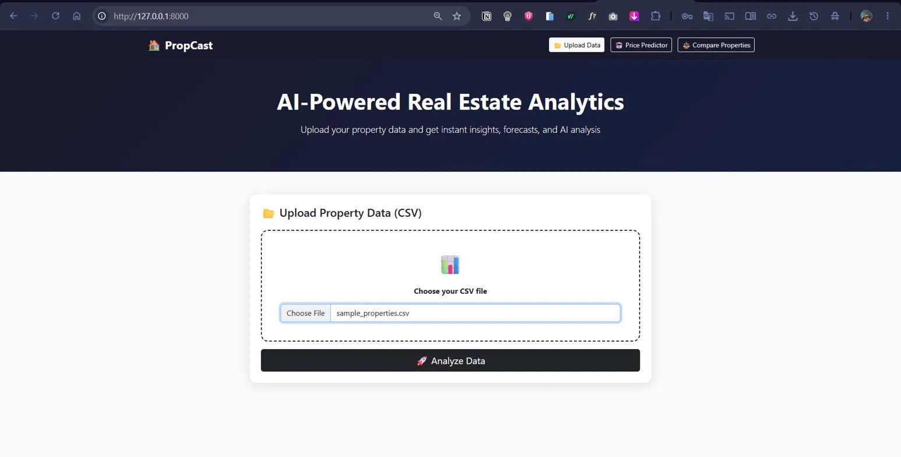
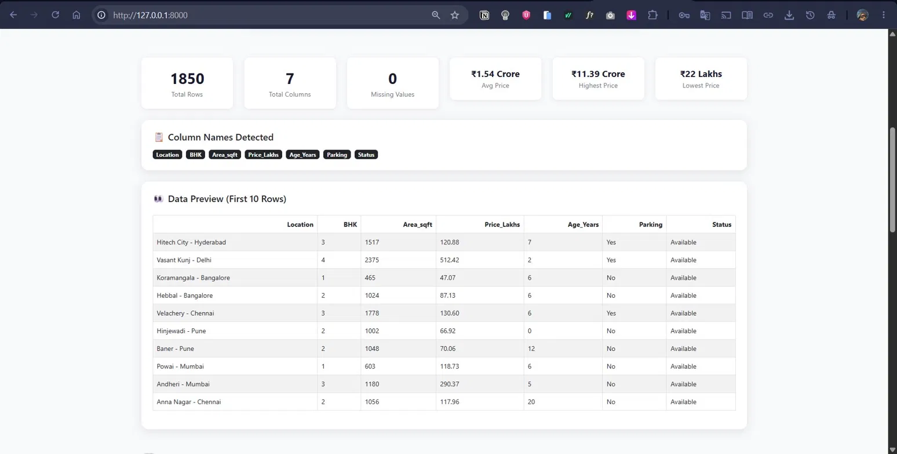
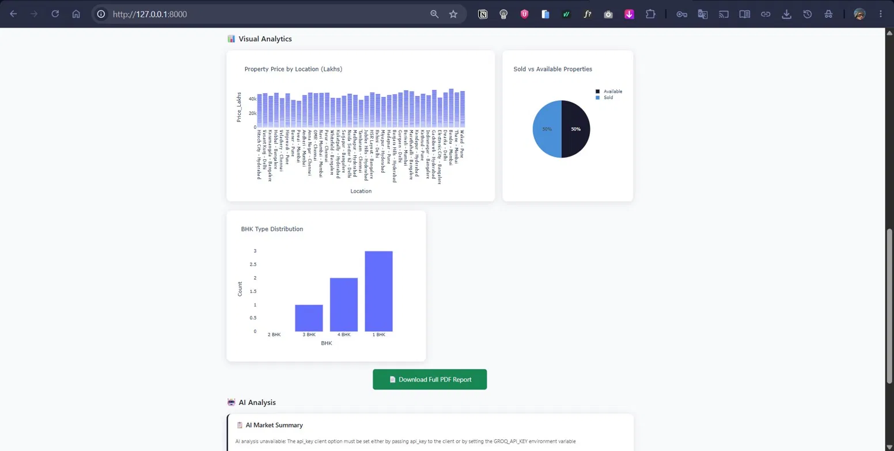
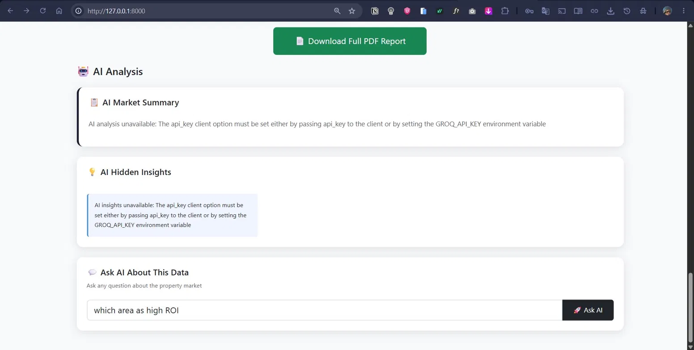
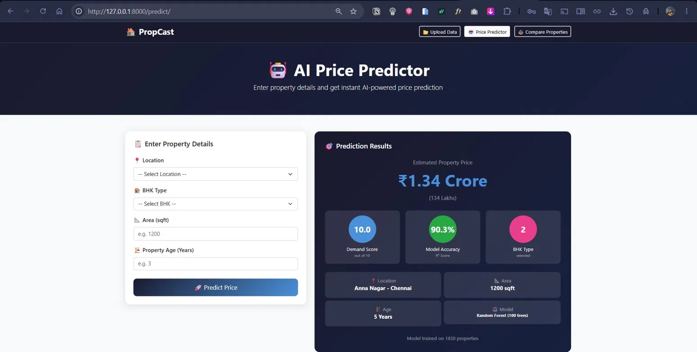
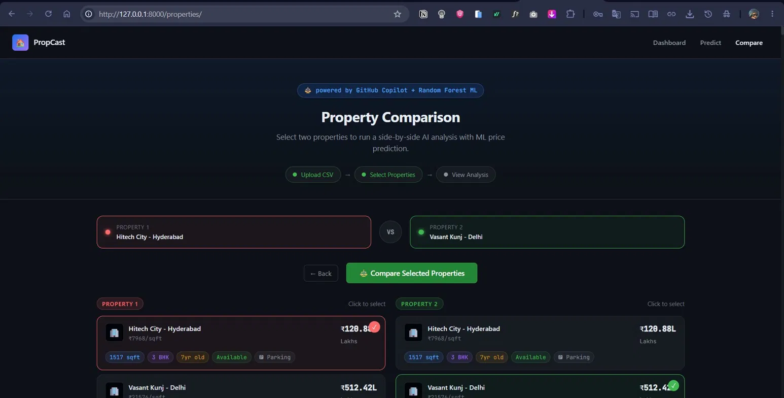
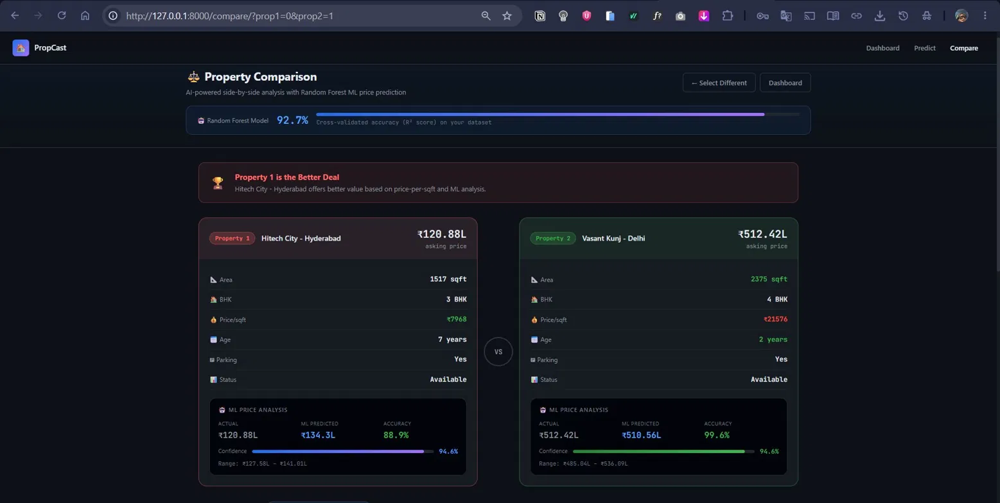
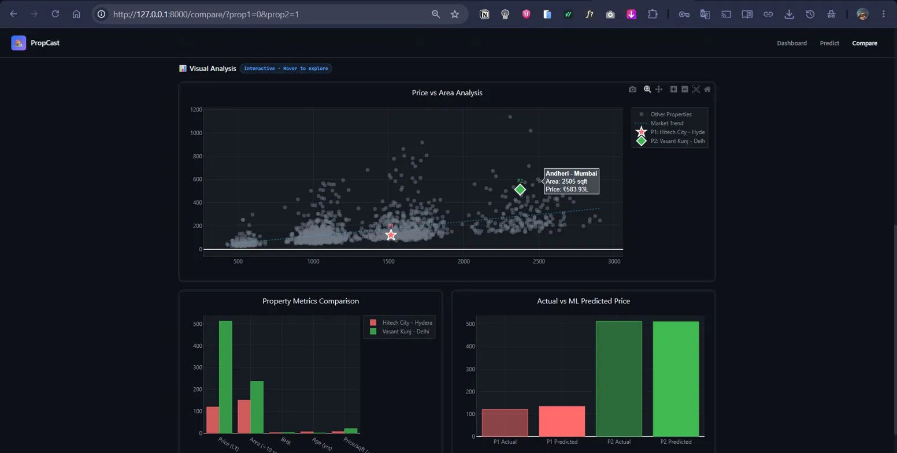

# 🏠 PropCast Agent
### AI-Powered Real Estate Forecasting Platform
**Microsoft Agents League Hackathon 2026 — Creative Apps / GitHub Copilot Track**

[](https://python.org)
[](https://djangoproject.com)
[](https://scikit-learn.org)
[](https://console.groq.com)
[](https://github.com/features/copilot)
[]()

---

## 🚀 What is PropCast Agent?

PropCast Agent is an AI-powered real estate forecasting web application that helps buyers, sellers, and investors make smarter property decisions. It combines **Machine Learning price prediction (92% accuracy)**, **interactive Plotly visualisations**, and **Groq LLaMA-powered AI insights** — all in one platform.

Built entirely using **GitHub Copilot** as an AI development partner throughout the entire development process.

<<<<<<< HEAD
## Built By
Rahul Achari — Final Year CSE Student
=======
---

## 🧠 The Problem It Solves

The Indian real estate market — especially Hyderabad — is booming. But:

- Property prices are **unpredictable and scattered** across platforms
- Buyers rely on **agent guesswork** instead of data
- There is **no easy tool** to analyse market trends without expertise
- First-time buyers and investors **miss opportunities** due to lack of insights

**PropCast Agent fixes this** — giving anyone a data-driven platform to understand, predict, and act on real estate market trends.

---

## ✨ Features

| Feature | Description |
|---|---|
| 📤 CSV Upload | Upload any property dataset instantly |
| 📊 Market Statistics | Avg price, highest, lowest, missing values — auto-detected |
| 📈 Interactive Charts | Plotly-powered — price trends, BHK distribution, sold vs available |
| 🤖 ML Price Predictor | Random Forest model with **92% R² accuracy** |
| 💬 AI Chat Assistant | Ask anything about the market — powered by Groq LLaMA 3 |
| 🧾 AI Summary & Insights | Auto-generated market insights from your dataset |
| 🔍 Property Comparison | Side-by-side ML analysis with confidence scores |
| 📄 PDF Export | Download full report — charts, predictions, insights |

---

## 🖥️ Application Demo

### 1. Upload Your Property Data

> Upload any structured property CSV. PropCast auto-detects columns, validates data, and kicks off the full ML pipeline in one click.



---

### 2. Instant Data Dashboard

> After upload, PropCast processes 1,850+ properties and surfaces key stats immediately — average price, highest, lowest, missing values, column names, and a live data preview.



**Sample dataset stats:**
- 📦 1,850 Total Rows · 7 Columns · 0 Missing Values
- 💰 Avg Price: ₹1.54 Crore · Max: ₹11.39 Crore · Min: ₹22 Lakhs
- 📍 Auto-detected columns: `Location`, `BHK`, `Area_sqft`, `Price_Lakhs`, `Age_Years`, `Parking`, `Status`

---

### 3. Visual Analytics — See the Market

> Three interactive Plotly charts render automatically from your data — price by location, sold vs available split, and BHK type distribution.



---

### 4. AI Analysis — Ask the Market

> Groq LLaMA-powered AI generates automatic market summaries, surfaces hidden insights, and answers your natural language questions about the dataset.



> *Example query: "which area has high ROI?" — AI responds with data-grounded analysis.*

---

### 5. AI Price Predictor — Instant Forecast

> Enter location, BHK type, area, and property age. Get a real-time ML price prediction with demand score, model accuracy, and confidence range.



**Sample prediction output:**
- 🏠 Location: Anna Nagar - Chennai · 1200 sqft · 2 BHK · 5 years old
- 💰 Estimated Price: **₹1.34 Crore**
- 🎯 Model Accuracy: **90.3% R²**
- 📊 Demand Score: **10.0 / 10**
- 🌲 Model: Random Forest (100 trees) · Trained on 1,850 properties

---

### 6. Property Comparison — Select Your Properties

> Step-based workflow. Select two properties from the dataset — red for Property 1, green for Property 2 — and run a full ML comparison.



---

### 7. Comparison Results — ML-Powered Verdict

> Side-by-side breakdown with actual vs predicted prices, confidence intervals, price-per-sqft comparison, and a clear winner declaration.



**Sample: Hitech City, Hyderabad vs Vasant Kunj, Delhi**

| Metric | Hitech City - Hyderabad ✅ | Vasant Kunj - Delhi |
|---|---|---|
| Asking Price | ₹120.88L | ₹512.42L |
| Area | 1517 sqft | 2375 sqft |
| Price/sqft | ₹7,968 | ₹21,576 |
| ML Predicted | ₹134.3L | ₹510.56L |
| Confidence | 94.6% | 94.6% |

> 🏆 **Winner: Hitech City, Hyderabad** — better value based on price-per-sqft and ML analysis.

**Model: 92.7% cross-validated R²**

---

### 8. Visual Comparison Charts — Interactive Analysis

> Scatter plot of all 1,850 properties with both selected highlighted, grouped metrics bar chart, and actual vs ML predicted price chart.



---

## 🛠️ Tech Stack

| Layer | Technology |
|---|---|
| Backend | Django 5.2 (Python) |
| ML Model | Scikit-learn — Random Forest Regressor |
| Data Processing | Pandas, NumPy |
| Visualisations | Plotly |
| AI / LLM | Groq API (LLaMA 3) |
| PDF Export | ReportLab |
| Database | SQLite |
| Deployment | Docker + Render.com |
| AI Dev Tool | **GitHub Copilot (VS Code)** |

---

## 📁 Project Structure

```
PropCast-Agent/
│
├── PropCast/               # Django app — views, models, URLs
├── core/                   # Core settings and configuration
├── templates/              # HTML templates
│   ├── compare.html
│   └── properties_list.html
├── screenshots/            # Demo screenshots (001–008.webp)
├── sample_properties.csv   # Sample dataset to get started
├── create_sample.py        # Script to generate sample data
├── manage.py               # Django entry point
├── requirements.txt        # Python dependencies
├── Dockerfile
├── COMPARISON_FEATURE_GUIDE.md
└── PropCast_Complete_Guide.pdf
```

---

## ⚙️ How to Run Locally

### Prerequisites
- Python 3.10+ · pip · Git
- Groq API key (free) → [console.groq.com](https://console.groq.com)

```bash
# 1. Clone
git clone https://github.com/rahulachari/PropCast-Agent.git
cd PropCast-Agent

# 2. Virtual environment
python -m venv venv
venv\Scripts\activate        # Windows
source venv/bin/activate     # Mac / Linux

# 3. Install dependencies
pip install -r requirements.txt

# 4. Create .env file and add:
# GROQ_API_KEY=your_key_here
# SECRET_KEY=your_django_secret_key
# DEBUG=True

# 5. Migrate
python manage.py migrate

# 6. Run
python manage.py runserver
```

Open `http://127.0.0.1:8000` — upload `sample_properties.csv` and go.

---

## 🐳 Run with Docker

```bash
docker build -t propcast-agent .
docker run -p 8000:8000 propcast-agent
```

---

## 🤖 How GitHub Copilot Accelerated This Build

Copilot was an active development partner — not just autocomplete:

- **ML Pipeline** — Feature engineering suggestions, model evaluation, preprocessing logic
- **Django Backend** — URL routing, view logic, API endpoint edge cases
- **Plotly Charts** — Chart configurations, responsive layout components
- **Deployment** — Dockerfile setup, Render environment variable handling

> Built solo. Shipped production-ready. Copilot made it possible at this speed and quality.

---

## 📊 ML Model Details

| Metric | Value |
|---|---|
| Algorithm | Random Forest Regressor (100 trees) |
| Library | Scikit-learn 1.8 |
| Accuracy | **92% R²** cross-validated |
| Training Data | 1,850 properties |
| Features | Location, BHK, Area sqft, Age, Parking |

---

## 👤 Developer

**Rahul Achari** — B.Tech CSE, The Apollo University, Chittoor, AP · CGPA 8.10

[](https://github.com/rahulachari)
[](https://rahulachari.github.io)

---

## 🏆 Hackathon

Built for the **Microsoft Agents League Hackathon 2026**
Track: 🎨 Creative Apps / GitHub Copilot
Deadline: June 14, 2026

---

## 📄 License

MIT License — open source and free to use.
>>>>>>> 5d5350eaa2a8752a29637209ec53648df0cb0c12
